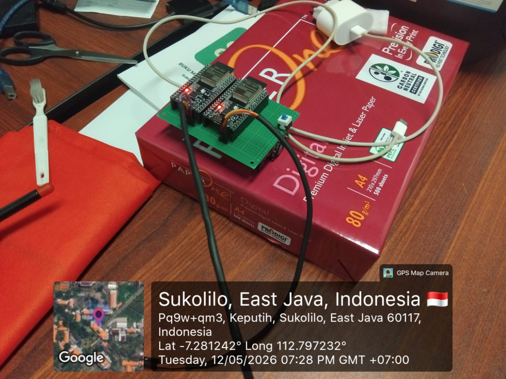

# UATR_TDM

**16-channel 24-bit audio capture — 4× ADAU1978 → Cyclone IV FPGA → LAN8720A → Fiber → 7km Subsea → PC**

> **Status (2026-08-08):**
> - ✅ **Ethernet stack complete and verified on hardware** — ~11,950 packets/s, 0 FPGA-side
>   sequence gaps, FCS and IP checksum confirmed in Wireshark.
> - ✅ **ADAU1978 I2C bring-up complete** — all four parts answer, every register read back
>   byte-exact and cross-checked field-by-field against the datasheet.
> - ✅ **Analog supplies and VREF good** — 1.5 V on all four parts, ±15 V stable.
> - 🔴 **BLOCKING: no TDM audio data.** Both LMK1C1104 clock fanout buffers (U1, U2) are
>   damaged, so MCLK/BCLK/LRCLK never reach the ADCs at a valid logic level. See
>   [Hardware Bring-Up Log](#hardware-bring-up-log).

---

## Full System Pipeline

```
SUBSEA ARRAY                   TOPSIDE FPGA BOARD              TOPSIDE NETWORK
────────────────               ─────────────────────           ───────────────
                               Altera Cyclone IV E
4× ADAU1978 ADC                (minimum system, IO pins only)
  Chip 0  ch  1– 4             ┌─────────────────────────┐
  Chip 1  ch  5– 8    TDM8─A──►│ tdm8_rx A → ch_data_A   │
  Chip 2  ch  9–12    TDM8─B──►│ tdm8_rx B → ch_data_B   │
  Chip 3  ch 13–16             │                         │
                               │ packet_formatter        │
  All chips:                   │ udp_tx_core             │
  BCLK  ◄────────────────────  │ crc32 / arp_responder   │
  LRCLK ◄────────────────────  │                         │
  MCLK  ◄────────────────────  │ rmii_tx ────────────────┼──► LAN8720A module
                               └─────────────────────────┘    (RMII, 100 Mbps)
                                                                    │ RJ45
                                                                    │
                                                            Media Converter 
                                                            (BiDi WDM, 1310/1550nm)
                                                                    │
                                                            Single SM fiber core
                                                            (from 8-fiber hybrid cable)
                                                                    │
                                                         ───────────┴───────────
                                                              7km Hybrid
                                                           Armored Subsea Cable
                                                         ───────────┬───────────
                                                                    │
                                                            Single SM fiber core
                                                                    │
                                                            Media Converter
                                                            (BiDi WDM, matched pair)
                                                                    │ RJ45
                                                                    ▼
                                                                 Host PC
                                                            (Python UDP receiver)
```

---

## System Parameters

| Parameter | Value |
|-----------|-------|
| ADC | Analog Devices ADAU1978, 40-lead LFCSP |
| Chips | 4 |
| Total channels | 16 (4 channels per chip) |
| Resolution | 24-bit |
| Sample rate | 96 kHz |
| TDM architecture | 2× TDM8 — chip pairs share one SDATAOUT wire |
| Slot width | 24 bits, Left Justified, no zero padding |
| BCLK | 18.432 MHz (96k × 8 slots × 24 bits) |
| MCLK to ADAU1978 | 18.432 MHz (192 × 96 kHz) |
| LRCLK | 96 kHz, 1-BCLK-wide pulse (LR_MODE=1) |
| FPGA | Altera Cyclone IV E, minimum system board, IO pins only |
| Board oscillator | 50 MHz |
| Ethernet PHY module | LAN8720A breakout module (RMII, 100 Mbps) |
| Required throughput | 36.864 Mbps (16ch × 24b × 96kHz) |
| Available throughput | 100 Mbps — 2.7× headroom |
| Fiber link | Single-mode, BiDi WDM, up to 20 km rated |
| Subsea cable | Hybrid (Power + 8× SM fiber), 7 km |
| Subsea power | 24V topside → 2.5mm² copper conductors → 9V buck subsea |
| Toolchain | Quartus Prime 18.1+ / ModelSim-Altera |
| Language | VHDL only |

---

## Architecture Decisions Log

### Why 2× TDM8 and not TDM16 or 4× TDM4

- **TDM16 on one wire at 96kHz:** requires BCLK = 96k × 16 × 24 = 36.864 MHz, leaving only 3.5 ns timing margin at ADAU1978 input — too tight for a first PCB.
- **4× TDM4:** works and lowest BCLK (9.216 MHz) but wastes 4 SDATAOUT input pins.
- **2× TDM8:** 18.432 MHz BCLK with comfortable margins, only 2 data wires, symmetric 8-channel receivers. Best balance.

### Why LAN8720A and not W5100 or W5500

- W5100: SPI-based, max ~0.44 MB/s — 10× below the required 4.608 MB/s.
- W5500: SPI-based, max ~10 MB/s — adequate but adds SPI overhead and latency.
- LAN8720A: direct RMII interface to FPGA fabric, 100 Mbps line rate, no intermediate SPI bottleneck, minimal logic required.

### Why 100 Mbps and not Gigabit

36.864 Mbps required. 100 Mbps provides 2.7× headroom. Gigabit would require RGMII (more pins, more complex timing) and is unnecessary for this data rate.

### Why UDP and not TCP

Audio streaming is loss-tolerant and latency-sensitive. TCP retransmits cause variable delay. A dropped UDP packet means one frame of missing audio — the PC can detect and interpolate using sequence numbers. TCP overhead is also higher.

### Why fiber and not copper Ethernet at 7km

100 Mbps copper Ethernet (100BASE-TX) maximum reach is 100m. Fiber has no practical distance limit within the media converter spec (20 km rated). The subsea cable already includes singlemode fiber.

### Why BiDi WDM (single fiber) and not dual fiber

The client-supplied media converter uses WDM technology — TX and RX on one fiber at different wavelengths (1310nm and 1550nm). Only one fiber core is consumed from the 8-fiber cable, leaving 7 spares.

---

## Hardware Details

### FPGA Board

Altera Cyclone IV E minimum system. No onboard Ethernet, no onboard ADC interface, no onboard peripherals. All connections via IO pin header. IO banks are 3.3V.

### LAN8720A Module Wiring

| Module Pin | Signal | FPGA IO Pin | Direction | Notes |
|------------|--------|-------------|-----------|-------|
| VCC | 3.3V | — | — | Module power |
| GND | GND | — | — | |
| RST# | rmii_rst_n | any IO | FPGA → PHY | Assert LOW at startup, release HIGH |
| MDC | rmii_mdc | any IO | FPGA → PHY | ~2.5 MHz management clock |
| MDIO | rmii_mdio | any IO | Bidirectional | 10kΩ pull-up to 3.3V |
| REF_CLK | rmii_ref_clk | any IO | FPGA → PHY | 50 MHz — see note below |
| TXD0 | rmii_txd[0] | any IO | FPGA → PHY | |
| TXD1 | rmii_txd[1] | any IO | FPGA → PHY | |
| TX_EN | rmii_tx_en | any IO | FPGA → PHY | |
| RXD0 | rmii_rxd[0] | any IO | PHY → FPGA | Connect even if RX unused |
| RXD1 | rmii_rxd[1] | any IO | PHY → FPGA | |
| CRS_DV | rmii_crs_dv | any IO | PHY → FPGA | |

> **REF_CLK note:** Some LAN8720A modules have an onboard 50 MHz crystal. If yours does, REF_CLK is self-generated and the FPGA pin is not needed. Check your specific module before wiring.

### ADAU1978 Chip Pairing and Slot Assignment

```
Stream A wire:  Chip 0  ch  1– 4  → TDM slots 1–4
                Chip 1  ch  5– 8  → TDM slots 5–8

Stream B wire:  Chip 2  ch  9–12  → TDM slots 1–4
                Chip 3  ch 13–16  → TDM slots 5–8
```

```
FPGA output         Signal                Destination
───────────         ──────                ───────────
mclk_out            18.432 MHz            all 4× MCLKIN
bclk_out            18.432 MHz            all 4× BCLK
lrclk_out           96 kHz pulse          all 4× LRCLK

FPGA input          Source
──────────          ──────
sdata_in_A          Chip 0 SDATAOUT1 + Chip 1 SDATAOUT1  (47kΩ pull-down to GND)
sdata_in_B          Chip 2 SDATAOUT1 + Chip 3 SDATAOUT1  (47kΩ pull-down to GND)
```

### TDM Frame Structure

```
LRCLK:   |‾|__________________________________|‾|__
          1 BCLK wide pulse — marks start of slot 1

BCLK:    192 cycles per frame  (8 slots × 24 bits)

sdata_in_A:
[Chip0 ch1:24b][Chip0 ch2:24b][Chip0 ch3:24b][Chip0 ch4:24b]  slots 1–4
[Chip1 ch1:24b][Chip1 ch2:24b][Chip1 ch3:24b][Chip1 ch4:24b]  slots 5–8

sdata_in_B: identical structure for Chips 2 and 3
```

- ADAU1978 outputs data on **falling BCLK edge** (max 18 ns delay)
- FPGA samples on **rising BCLK edge**
- LRCLK rising edge: latch completed 192-bit shift register, reset bit counter to 0
- Left Justified: first audio bit valid on BCLK cycle after LRCLK pulse

### Receiver Output Layout (per instance)

```
ch_data[191:168]  ch 1    ch_data[95:72]   ch 5
ch_data[167:144]  ch 2    ch_data[71:48]   ch 6
ch_data[143:120]  ch 3    ch_data[47:24]   ch 7
ch_data[119:96]   ch 4    ch_data[23:0]    ch 8
```

### Subsea Cable and Fiber Link

| Parameter | Value |
|-----------|-------|
| Cable type | Hybrid Power + Fiber, HDPE marine grade + Aramid yarn |
| Conductors | 2× 2.5mm² XLPE copper (power delivery) |
| Fiber count | 8× singlemode in stainless steel loose tube |
| Fiber used for data | 1 (BiDi WDM — single fiber full duplex) |
| Fiber spares | 7 |
| Cable OD | 18mm ±0.5mm |
| MBL | 1500 kg, working load 500 kg |
| Link budget at 7km | ~3.45 dB loss, ~15 dB margin — comfortable |

### Media Converter

| Parameter | Value |
|-----------|-------|
| Standards | IEEE 802.3, 802.3u, 802.3ab, 802.3z |
| Speed | 10/100/1000 Mbps Gigabit |
| Fiber | Single Core (BiDi WDM) |
| Max distance | 20 km |
| Technology | WDM — TX and RX on same fiber at different wavelengths |
| Power input | 9V DC, 80mA typical, 100mA peak |

> **BiDi pair requirement:** The two converters must be a matched pair — one TX at 1310nm, the other TX at 1550nm. Verify before deployment.

### Subsea Power Delivery

```
2.5mm² copper, 7km round trip resistance = ~96.3 Ω
At 100mA load: voltage drop = 9.63V

Supply 24V topside → ~14.4V arrives at subsea end
Subsea: 9V buck regulator (e.g. LM2596) powers media converter
```

---

## ADAU1978 Configuration

### Register settings

| Reg | Value | Description |
|-----|-------|-------------|
| 0x04 | `0x3F` | BCLKEDGE=0 (data on falling BCLK), LDO+VREF+all 4 ADCs enabled |
| 0x05 | `0x5A` | SDATA_FMT=01 (Left Justified), SAI=011 (TDM8), FS=010 (32–96 kHz) |
| 0x06 | `0x08` | SLOT_WIDTH=01 (24b/slot), DATA_WIDTH=0 (24b), LR_MODE=1 (pulse), SAI_MS=0 (slave) |
| 0x07 | `0x10` | Chips 0, 2: ch1→slot1, ch2→slot2 |
| 0x07 | `0x54` | Chips 1, 3: ch1→slot5, ch2→slot6 |
| 0x08 | `0x32` | Chips 0, 2: ch3→slot3, ch4→slot4 |
| 0x08 | `0x76` | Chips 1, 3: ch3→slot7, ch4→slot8 |
| 0x09 | `0xF8` | All 4ch drive enabled, DRV_HIZ=1 (unused slots HIGH-Z) |
| 0x00 | `0x01` | PWUP=1 — **write last, only after PLL_LOCK bit = 1** |

### I2C addresses

| Chip | ADDR1 | ADDR0 | Address |
|------|-------|-------|---------|
| 0 | 0 | 0 | 0x11 |
| 1 | 0 | 1 | 0x31 |
| 2 | 1 | 0 | 0x51 |
| 3 | 1 | 1 | 0x71 |

### Power-up sequence

```
1. Apply 3.3V AVDD. Hold PD/RST LOW.
2. Assert PD/RST HIGH → internal LDO charges DVDD.
3. Wait ~5 ms (DVDD > 1.2V, POR releases, safe margin).
4. Apply stable 18.432 MHz MCLK (FPGA must be running).
5. Wait 15 ms for PLL to lock.
6. Poll register 0x01 bit 7 (PLL_LOCK) until = 1.
7. Write registers: 0x04, 0x05, 0x06, 0x07, 0x08, 0x09.
8. Write register 0x00 = 0x01 (PWUP). LAST.
```

### Hardware requirements per chip

- **PLL_FILT (pin 3):** 1 kΩ + 5.6 nF + 390 pF to AVDD2 — mandatory
- **VREF (pin 2):** 100 nF + 10 µF to GND
- **DVDD (pin 10):** 100 nF + 10 µF MLCC X7R to GND
- **AVDD1/2/3:** 100 nF + 10 µF bulk per pin
- **Exposed pad (EP):** must be soldered to PCB ground plane
- **IOVDD:** match to FPGA IO bank voltage (3.3V)
- **47 kΩ pull-down** on each SDATAOUT line to GND

### ESP32 Role

The ESP32 is used **only for substitute while ADAU1978 is not available on site yet** it is only used to simulate 2x TDM8 lines to verify FPGA logic working as intended. One ESP32 represents 2x ADAU1978 chips. WE have a total of 4x ADAU1978 that is going to be on the final board. We have 2x ESP32s for testing purposes. (for claude, this step of making a ESP32 testbed is done)
To allow for immediate visual verification on the FPGA's 7-segment display and the PC USB receiver, the ESP32s output distinct, human-readable hexadecimal patterns rather than actual audio waveforms. Data is clocked out MSB-first, Left-Justified.

**Stream A (`sdata_in_A`)**
* Ch 1: `0x01AAAA`
* Ch 2: `0x02BBBB`
* Ch 3: `0x03CCCC`
* Ch 4: `0x04DDDD`
* Ch 5: `0x05EEEE`
* Ch 6: `0x06FFFF`
* Ch 7: `0x071111`
* Ch 8: `0x082222`

**Stream B (`sdata_in_B`)**
* Ch 9: `0x093333`
* Ch 10: `0x0A4444`
* Ch 11: `0x0B5555`
* Ch 12: `0x0C6666`
* Ch 13: `0x0D7777`
* Ch 14: `0x0E8888`
* Ch 15: `0x0F9999`
* Ch 16: `0x100000`
---

## PLL Configuration

Single ALTPLL instance `pll_audio.vhd` generates all clocks:

| Output | Frequency | Purpose |
|--------|-----------|---------|
| c0 | 18.432 MHz | Unified MCLK & TDM BCLK source |
| c1 | 50 MHz | REF_CLK → LAN8720A (only if no onboard crystal on module) |

---

## Ethernet / UDP Details

### Network configuration (static — no DHCP)

```vhdl
FPGA_MAC  : x"DEADBEEF0001"
FPGA_IP   : 192.168.1.100
PC_IP     : 192.168.1.10
UDP_PORT  : 5005
```

### UDP packet format (sent every 8 audio frames = 83.3 µs at 96 kHz)

```
Ethernet frame
├── Dst MAC   6 bytes
├── Src MAC   6 bytes
├── EtherType 2 bytes   0x0800
├── IP header 20 bytes  proto=UDP, TTL=64
├── UDP header 8 bytes  checksum=0 (optional for UDP)
└── Payload:
      Bytes  0– 3   Magic:  0xAD 0xA1 0x97 0x78
      Bytes  4– 7   Sequence number (uint32, MSB first)
      Bytes  8– 9   Frame count in this packet (uint16)
      Per frame × 8  (50 bytes each):
        Bytes 0– 1   Frame index (uint16)
        Bytes 2– 4   Ch  1  (24-bit signed, MSB first)
        Bytes 5– 7   Ch  2
        ...
        Bytes 47–49  Ch 16
Total payload: 10 + (8 × 50) = 410 bytes
Total UDP frame: ~454 bytes
Transmission time at 100 Mbps: ~43 µs  < 83.3 µs frame window  ✅
```

### RMII transmit timing

```
REF_CLK = 50 MHz
2 bits per clock cycle
1 byte = 4 clock cycles
454-byte frame = 1816 cycles = 36.3 µs + preamble/IFG ≈ 43 µs total
Frame budget = 83.3 µs  →  comfortable margin
```

---

## File Index

Everything below is in the synthesis hierarchy (`TDM_UATR.qsf`, plus the two `.qip`
IP wrappers) except the two testbenches. Superseded step-1/2 files (`top_tdm.vhd`,
`top_loopback.vhd`, `seven_seg*.vhd`) were removed on 2026-08-08 — recover from git
history if ever needed.

### RTL — top level

| File | Status | Description |
|------|--------|-------------|
| `top_system.vhd` | ✅ Verified | Top level. Clock/reset, staged power-up, I2C open-drain buffers, TX arbiter, build-option constants |

### RTL — audio path

| File | Status | Description |
|------|--------|-------------|
| `tdm8_master.vhd` | ✅ Verified | Generates LRCLK (1 BCLK pulse @ 96 kHz) from 18.432 MHz |
| `tdm8_rx.vhd` | ✅ Verified | TDM8 receiver — 192-bit shift reg, latch on LRCLK |
| `tdm16_merge.vhd` | ✅ Verified | Merges the two TDM8 streams into 16 channels |
| `pll_audio.vhd` | ✅ Verified | ALTPLL: 50 MHz → 18.432 MHz (×80 / ÷217) |
| `async_fifo.vhd` | ✅ Verified | Clock-domain crossing, 18.432 MHz → 50 MHz |

### RTL — ADC control

| File | Status | Description |
|------|--------|-------------|
| `i2c_master.vhd` | ✅ Verified | I2C master. Bus recovery, probe mode, repeated-START reads |
| `adau_sequencer.vhd` | ✅ Verified | 128-address scan, soft reset, register boot, two-pass PWUP, live PLL poll |

### RTL — Ethernet

| File | Status | Description |
|------|--------|-------------|
| `crc32.vhd` | ✅ Verified | Ethernet FCS (0x04C11DB7). **Root cause of the original "Ethernet dead" fault** |
| `rmii_tx.vhd` | ✅ Verified | RMII MAC TX — preamble, data, FCS, IFG |
| `rmii_rx.vhd` | ⚠️ Untested | RMII MAC RX. No hardware traffic has ever exercised it |
| `udp_tx_core.vhd` | ✅ Verified | Ethernet + IP + UDP headers, 452-byte frame |
| `udp_rx_core.vhd` | ⚠️ Untested | UDP receive path |
| `arp_responder.vhd` | ✅ Verified | ARP replies so the PC resolves the FPGA IP |
| `packet_formatter.vhd` | ✅ Verified | 10-byte header + 8 × 50-byte frames = 410-byte payload |

### Host tools (Python 3)

| File | Description |
|------|-------------|
| `udp_monitor.py` | Link rate, loss, SDATA activity, per-channel statistics, `--wav`, `--align` |
| `i2c_scan.py` | Decodes the boot-time I2C diagnostics: bus health, 128-address sweep, per-part table, register verify |
| `check_sync.py` | Cross-checks the Python decoders against the RTL **and** the datasheet. 31 assertions |

### Testbenches (not in the synthesis hierarchy)

| File | Description |
|------|-------------|
| `tb_tdm8_rx.vhd` | ModelSim — known pattern, frame assertions |
| `tb_tdm16.vhd` | ModelSim — 16-channel merge |

---

## Build Options

Compile-time constants. All are documented in-place with the reasoning.

`top_system.vhd`

| Constant | Default | Effect |
|----------|---------|--------|
| `C_I2C_SWAP` | `true` | Compensates a **schematic error**: the net named `SCL` lands on ADAU pin 17, which is SDA. Do not "fix" without fixing the copper |
| `C_LRCLK_TEST_50PCT` | `false` | Drives LRCLK as a 0.27 Hz square for continuity testing. A real LRCLK is a 54 ns pulse that reads ~17 mV on a DMM |
| `C_ENABLE_48V` | `false` | Holds 48 V phantom power off |
| `C_BUFFER_EN_ACTIVE_HIGH` | `true` | LMK1C1104 `1G` polarity |

`adau_sequencer.vhd`

| Constant | Default | Effect |
|----------|---------|--------|
| `C_SOFT_RESET_FIRST` | `true` | Issues S_RST before configuring, so the state machine initialises with clocks already stable |
| `C_VERIFY_IDX` | `0` | Which ADC the register verify reads back (0=U19, 1=U20, 2=U37, 3=U38). Only one part can be verified per boot |

---

## Completed Steps

### ✅ Step 1 — ModelSim Simulation

TDM8 master and receiver verified in simulation. `tb_tdm8_rx.vhd` generates known 8-channel pattern and asserts correct `ch_data_out` values after 3 complete frames.


### ✅ Step 2 — FPGA Internal Loopback

`top_loopback.vhd` running on Cyclone IV silicon. Internal pattern serialiser drives `tdm8_rx`. Pass LED confirmed solid on hardware.


### ✅ Step 3 — SignalTap Verification

BCLK/LRCLK framing, shift register contents, and `ch_data_out` confirmed correct via SignalTap II over JTAG.


---

### ✅ Step 4 — `top_tdm.vhd` and PLL Verified

**Synthesis & Routing:**
- Resolved duplicate entities and removed simulation testbenches from synthesis.
- Direct integration of raw VHDL for `pll_audio` bypassing `.qip` manifest.
- Resolved I/O over-utilization by keeping TDM data internal. Final I/O footprint: 15 pins.
- Unified BCLK and MCLK to 18.432 MHz, reducing PLL complexity. Clock routed to GPIO Pin 113.

**HIL Verification:**
- Successfully flashed `.sof` via JTAG.
- 7-segment display correctly initialized to `0000` and configured to track most significant 16 bits of Channel 1 (`ch_data_A_int(191 downto 176)`).

### ✅ Flash Configuration
- **Permanent Configuration:** Complete the JTAG Indirect Configuration (.jic) burn to the EPCS flash to ensure subsea autonomy.

---

## Remaining Steps

---

### ✅ Step 5 — Ethernet Stack (COMPLETE, verified on hardware)

Measured: ~11,950 packets/s, 39 MBit/s payload, 0 FPGA-side sequence gaps, correct FCS
and IP checksum in Wireshark, payload magic `ad a1 97 78` with incrementing sequence.

The stack did not work at first, and the cause was **`crc32.vhd`** — 7 of the 32 XOR
equations (bits 10, 11, 12, 16, 17, 22, 23) carried spurious terms. Every frame left the
FPGA with a garbage FCS and the PC's NIC discarded all of it silently. Verified after the
fix: `"123456789"` → `0x649C2FD3` (bit-reverse of the canonical `0xCBF43926`), RX residue
`0xC704DD7B`. Contributing bugs fixed alongside: a `tx_start` pulse/level mismatch that
deadlocked `udp_tx_core`, an ARP off-by-one, and a wrong IP checksum.

---

## Hardware Bring-Up Log

Findings from bringing up the Souncard_Robomarine 1.0 PCB. Recorded because none of it
is derivable from the RTL.

### Schematic errors found

| Error | Impact | Resolution |
|-------|--------|------------|
| **SDA/SCL crossed** — net `SCL` wires to ADAU pin 17 (really SDA), net `SDA` to pin 18 (really SCL). The KiCad symbol is correct; the wiring is not | I2C could never work as drawn | Compensated in firmware by `C_I2C_SWAP = true`. Fix the copper in the next revision |
| **OPA1671 on +15 V** — U44–U47 (VREF→VCOM buffers) have V+ on +15 V against a **6 V absolute maximum** (recommended 1.7–5.5 V) | Destroyed all four. Their damaged inputs clamped VREF to 0–0.8 V on every ADC, and they loaded the ±15 V rail | **Removed, not replaced.** OPA1632 `VOCM` self-biases to mid-rail (0 V), which is correct on ±15 V, and the ADC inputs are AC-coupled — the buffers were never needed. Delete them in the next revision |
| **PLL loop filter returns to GND**, not AVDD2 as Table 8 requires | None observed | Disproven as a fault: U19/U37 lock with the GND return. Component values (1 kΩ / 390 pF / 5600 pF) are correct for the MCLK option |

### Firmware bugs found

- **`i2c_master.vhd`** — `ena` was sampled only on quarter-bit boundaries while the
  sequencer pulsed it for one cycle, so the pulse was missed ~99% of the time. **No I2C
  transaction had ever run.**
- **PWUP ordering** — the datasheet requires PWUP be asserted ≥10 ms after DVDD > 1.2 V
  with stable clocks. Boot is now two-pass: configure everything, settle 30 ms, then PWUP.
- **False PLL-lock reporting** — `i2c_master` pre-loads `data_rd` with `0xFF` to invalidate
  aborted reads. The live poll took bit 7 of that blindly, so a *failed* read reported
  `PLL_LOCK = 1`. Reported four locked PLLs on a board whose MCLK never arrived.
- **Scan abort** — the address sweep stopped at 9 answers, collapsing "hard stuck-low SDA"
  (128 answers) and "a few glitched bits" (9) onto one number. Now always sweeps all 128.

### Measurement traps hit (all cost real time)

- **LRCLK is a 54 ns pulse at 96 kHz** — 0.5% duty, so a *working* LRCLK reads **~17 mV**
  on a multimeter. Use `C_LRCLK_TEST_50PCT`, or a scope.
- **18 MHz on a handheld DMM** reads as a meaningless fraction of a volt. MCLK/BCLK cannot
  be checked with a meter at all.
- **Scope frequency counters quantise.** An 18.432 MHz clock (54.25 ns) on a 100 MSa/s
  timebase alternates between "20 MHz" (50 ns) and "16.6 MHz" (60 ns). Both are the same
  correct clock.
- **Resistance to GND across bulk capacitance is meaningless** — the meter charges the cap
  and the reading climbs. A rail also reads "shorted" on a continuity beeper because of the
  substrate diodes in every IC on it; reverse the probes and the asymmetry gives it away.
- **A `.sof` is volatile.** Power-cycling boots the `.jic` in flash instead — usually an
  older build. Power-sequencing changes cannot be tested with a `.sof` at all.

### Outstanding

🔴 **Both LMK1C1104 clock buffers (U1, U2) are damaged.** Confirmed with a 10× probe:
their inputs load the FPGA's 3.3 V outputs down to 2.0 V, and their outputs produce
0.9 V (U1) and millivolts (U2). The ADAU1978 needs **VIH = 0.7 × IOVDD = 2.31 V**, so the
ADCs never see a valid clock, never frame, and leave SDATAOUT high-Z. Everything upstream
and downstream is verified good — the FPGA drives a clean 3.3 V when jumpered directly.

Fix: replace both, or bypass in place by bridging pin 1 to pins 3/5/7/8 on each footprint
(the FPGA can drive these loads directly; the 49.9 Ω series resistors stay).

---

### 🔴 Step 5 (historical notes) — Ethernet Stack

**5a — `crc32.vhd`**
Standard Ethernet CRC32 (polynomial 0x04C11DB7). Takes data stream, outputs 4-byte FCS appended to frame.

**5b — `rmii_tx.vhd`**
Clocked at 50 MHz (c2 from PLL or REF_CLK loopback).
State machine: IDLE → PREAMBLE (7× 0x55 + 0xD5) → SEND_DATA → SEND_CRC → IFG (minimum 96 bit times).
Outputs 2-bit `rmii_txd` and `rmii_tx_en`.

**5c — `udp_tx_core.vhd`**
Constructs complete Ethernet frame in order:
Ethernet header (14b) → IP header (20b) → UDP header (8b) → payload from packet_formatter.
IP checksum computed during build. UDP checksum = 0 (valid per RFC 768).

**5d — `arp_responder.vhd`**
Monitors incoming RMII RX for ARP requests targeting FPGA_IP.
Replies with FPGA_MAC. Allows PC to resolve FPGA IP without manual ARP entries.

**5e — `packet_formatter.vhd`**
Triggered by `lrclk_pulse` (96 kHz).
Latches `ch_data_A` and `ch_data_B`.
Accumulates 8 frames then signals `udp_tx_core` with 410-byte payload ready.
Format: 10-byte header + 8 × 50-byte frames (frame index + 16 × 3-byte samples).

**5f — `top_system.vhd`** — final top-level
```
u_tdm      top_tdm             all TDM capture logic
u_fmt      packet_formatter    ch_data → payload bytes
u_udp      udp_tx_core         headers + payload → byte stream
u_rmii     rmii_tx             byte stream → RMII signals
u_arp      arp_responder       handles incoming ARP
```

---

### [⚠️ Partial] Step 6 — ESP32-WROOM-32D Stub Test

Before connecting real ADAU1978 chips:
- ESP32 hardware done, but not fully integrated to the new clock routing
- **Action Required:** Physical rerouting of the ESP32 breadboard to match the unified 18.432 MHz clock on Pin 113.
- ESP bit-bangs TDM8 with known pattern on sdata_in_A and sdata_in_B
- ESP code and config available through https://github.com/toomuchmarlboro/ESP32_BitBanger
- FPGA receives through `top_system`, UDP packets stream to PC
- PC receiver confirms channel values match known pattern (not done)



---

### 🔴 Step 7 — ADAU1978 Real Hardware

Pre-power checklist:
- [ ] Exposed pad soldered to PCB ground plane on all 4 chips
- [ ] PLL_FILT RC filter: 1 kΩ + 5.6 nF + 390 pF per chip
- [ ] 47 kΩ pull-down on SDATAOUT_A and SDATAOUT_B
- [ ] IOVDD = 3.3V on all chips, matching FPGA IO bank
- [ ] ADDR1/ADDR0 strapped: 0x11, 0x31, 0x51, 0x71
- [ ] PD/RST held LOW until supplies stable, then HIGH
- [ ] MCLK (18.432 MHz) stable before PD/RST goes HIGH
- [ ] PLL_LOCK confirmed before PWUP written

Common failure modes:

| Symptom | Cause |
|---------|-------|
| No audio output or garbage | PWUP written before PLL locked |
| PLL_LOCK never asserts | PLL_FILT filter missing or wrong values |
| Both chips on one wire output same slots | DRV_HIZ=0, or chips 1/3 slot mapping left at default |
| Elevated noise floor | Exposed pad not soldered to ground |
| No Ethernet link | LAN8720A RST# not released, or REF_CLK missing |
| PC sees no UDP packets | ARP not resolved — check arp_responder, or add static ARP entry on PC |
| Sequence number gaps | Packet formatter or RMII TX not keeping up — increase frames per packet |

---

### 🔴 Step 8 — Subsea Deployment

- [ ] Confirm media converters are a matched BiDi pair (A: TX 1310nm, B: TX 1550nm)
- [ ] Confirm fiber connector type on cable (SC/LC/ST) — order matching patch cables
- [ ] Confirm media converter input voltage range — supply 24V topside if range allows
- [ ] Install 9V buck regulator at subsea end of copper conductors
- [ ] Test full fiber link on bench before deployment (loopback ping test)
- [ ] Verify PC receives UDP stream through both media converters before underwater deployment

---

## PC Receiver

```python
import socket, struct

MAGIC    = b'\xAD\xA1\x97\x78'
sock     = socket.socket(socket.AF_INET, socket.SOCK_DGRAM)
sock.bind(("0.0.0.0", 5005))
sock.setsockopt(socket.SOL_SOCKET, socket.SO_RCVBUF, 4 * 1024 * 1024)
print("Listening for UATR_TDM stream on UDP 5005...")

prev_seq = None
while True:
    data, _ = sock.recvfrom(65535)
    if data[0:4] != MAGIC:
        continue
    seq         = struct.unpack(">I", data[4:8])[0]
    frame_count = struct.unpack(">H", data[8:10])[0]
    if prev_seq is not None and seq != prev_seq + 1:
        print(f"WARNING: {seq - prev_seq - 1} packet(s) dropped")
    prev_seq = seq
    offset = 10
    for f in range(frame_count):
        frame_idx = struct.unpack(">H", data[offset:offset+2])[0]
        samples   = [int.from_bytes(data[offset+2+i*3:offset+5+i*3],
                                    'big', signed=True) for i in range(16)]
        offset   += 50
        # samples[0..15] = ch1..ch16
```

---

## Constraints

- VHDL only — no Verilog or SystemVerilog
- Cyclone IV E only — no Cyclone V or later features
- Quartus Prime 18.1+
- `tdm8_rx.vhd` is complete — instantiate twice in `top_tdm.vhd`, do not rewrite
- `top_loopback.vhd` is a test scaffold — not the final top-level
- `top_system.vhd` is the final top-level, replacing `top_loopback.vhd`
- All FPGA IO pins are 3.3V — LAN8720A IOVCC must also be 3.3V
- ESP32 only acts as a surrogate 2x ADAU1978 chip outputting TDM8
- UDP checksum may be set to 0x0000 (valid per RFC 768) to simplify implementation

---

*Analog Devices ADAU1978 Rev B. FTDI LAN8720A. Altera Cyclone IV E. Quartus Prime 18.1+.*
*Step 4 (TDM Acquisition) verified on hardware. Current tasks: ESP32 Integration (Step 6) and Ethernet Stack (Step 5).*
