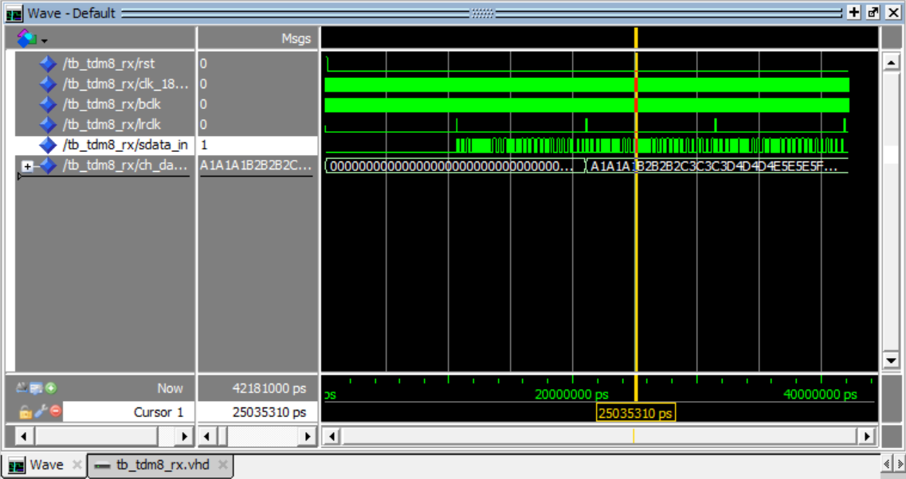
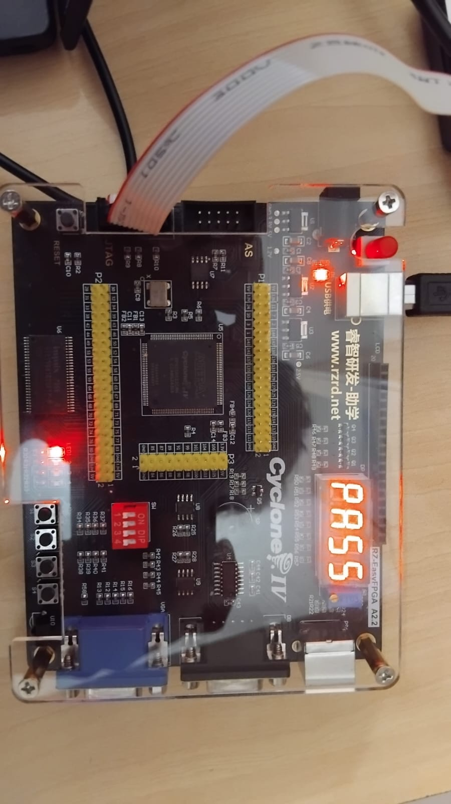
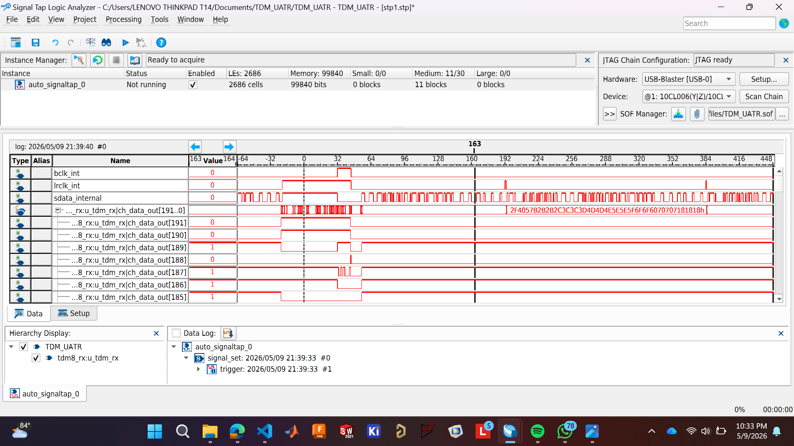

# UATR_TDM — 4× ADAU1978 16-Channel TDM Receiver on Cyclone IV FPGA

> **For AI agents:** This document is the single source of truth for this project.
> Read the full context section before helping with any task.
> Current status: Steps 1–3 complete. Next task: `top_tdm.vhd` + PLL + pin assignments.

---

## Project Summary

| Parameter | Value |
|-----------|-------|
| Goal | Receive 16ch 24-bit audio from 4× ADAU1978 ADCs into Cyclone IV FPGA |
| ADC chip | Analog Devices ADAU1978 (quad, 24-bit, 40-lead LFCSP) |
| Number of chips | 4 |
| Total channels | 16 (4 channels per chip) |
| Sample rate | 96 kHz |
| TDM architecture | 2× TDM8 streams — pairs of chips share one SDATAOUT wire each |
| Slot width | 24 bits (Left Justified, no zero padding) |
| BCLK | 18.432 MHz (96k × 8 slots × 24 bits) |
| MCLK | 12.288 MHz (128 × 96kHz, MCS=001 per ADAU1978 Table 9) |
| LRCLK | 96 kHz, 1-BCLK-wide pulse (LR_MODE=1) |
| FPGA | Altera Cyclone IV E (e.g. EP4CE115F29C7) |
| Board oscillator | 50 MHz |
| Toolchain | Quartus Prime 18.1+ / ModelSim-Altera |
| Language | VHDL only |

---

## Architecture

### Why 2× TDM8 (not TDM16, not 4× TDM4)

TDM16 on one wire would require 36.864 MHz BCLK with only 3.5 ns timing margin — too risky. 4× TDM4 works but wastes 4 separate SDATAOUT pins. 2× TDM8 is the sweet spot: 18.432 MHz BCLK, 2 data wires, symmetric 8-channel receivers.

### Chip pairing

```
Stream A:  Chip 0 (ch  1– 4) → TDM slots 1–4  ┐
           Chip 1 (ch  5– 8) → TDM slots 5–8  ┘ shared SDATAOUT_A wire

Stream B:  Chip 2 (ch  9–12) → TDM slots 1–4  ┐
           Chip 3 (ch 13–16) → TDM slots 5–8  ┘ shared SDATAOUT_B wire
```

### Full wiring diagram

```
FPGA (serial port MASTER — generates all clocks)
  │
  ├─ mclk_out  (12.288 MHz) ──┬──► Chip 0 MCLKIN
  │                            ├──► Chip 1 MCLKIN
  │                            ├──► Chip 2 MCLKIN
  │                            └──► Chip 3 MCLKIN
  │
  ├─ bclk_out  (18.432 MHz) ──┬──► Chip 0 BCLK
  │                            ├──► Chip 1 BCLK
  │                            ├──► Chip 2 BCLK
  │                            └──► Chip 3 BCLK
  │
  ├─ lrclk_out (96 kHz pulse) ┬──► Chip 0 LRCLK
  │                            ├──► Chip 1 LRCLK
  │                            ├──► Chip 2 LRCLK
  │                            └──► Chip 3 LRCLK
  │
  ├─ sdata_in_A ◄─────────── Chip 0 SDATAOUT1 + Chip 1 SDATAOUT1
  └─ sdata_in_B ◄─────────── Chip 2 SDATAOUT1 + Chip 3 SDATAOUT1

47kΩ pull-down to GND on sdata_in_A and sdata_in_B
(ADAU1978 output goes HIGH-Z during inactive TDM slots)
```

### TDM frame structure

```
LRCLK: |‾|______________________________________________|‾|__
        1 BCLK wide pulse, marks start of slot 1

BCLK:  192 cycles per frame  (8 slots × 24 bits)

sdata_in_A:
[Chip0-CH1: 24b][Chip0-CH2: 24b][Chip0-CH3: 24b][Chip0-CH4: 24b]
[Chip1-CH1: 24b][Chip1-CH2: 24b][Chip1-CH3: 24b][Chip1-CH4: 24b]
 ←── slot 1 ──→ ←── slot 2 ──→                   ←── slot 8 ──→

sdata_in_B: identical structure for chips 2 and 3
```

- Data changes on **falling BCLK edge** (ADAU1978 BCLKEDGE=0 default)
- FPGA samples on **rising BCLK edge**
- LRCLK rising edge = latch completed 192-bit frame, reset bit counter
- Left Justified: first audio bit is valid on the BCLK cycle AFTER LRCLK pulse

### Extracted channel mapping (per receiver)

```
ch_data_out[191:168]  = channel 1  (slot 1, 24 MSBs)
ch_data_out[167:144]  = channel 2
ch_data_out[143:120]  = channel 3
ch_data_out[119:96]   = channel 4  (from first chip on this wire)
ch_data_out[95:72]    = channel 5  (slot 5, from second chip)
ch_data_out[71:48]    = channel 6
ch_data_out[47:24]    = channel 7
ch_data_out[23:0]     = channel 8
```

---

## ADAU1978 Configuration

### Register settings for our exact setup

| Reg | Name | Value | Description |
|-----|------|-------|-------------|
| 0x04 | BLOCK_POWER_SAI | `0x3F` | LR_POL=0, BCLKEDGE=0, LDO+VREF+all 4 ADCs enabled |
| 0x05 | SAI_CTRL0 | `0x5A` | SDATA_FMT=01 (LJ), SAI=011 (TDM8), FS=010 (32–96kHz) |
| 0x06 | SAI_CTRL1 | `0x08` | SLOT_WIDTH=01 (24b), DATA_WIDTH=0 (24b), LR_MODE=1 (pulse), SAI_MS=0 (slave) |
| 0x07 | SAI_CMAP12 | `0x10` | Chips 0,2: ch1→slot1, ch2→slot2 |
| 0x07 | SAI_CMAP12 | `0x54` | Chips 1,3: ch1→slot5, ch2→slot6 |
| 0x08 | SAI_CMAP34 | `0x32` | Chips 0,2: ch3→slot3, ch4→slot4 |
| 0x08 | SAI_CMAP34 | `0x76` | Chips 1,3: ch3→slot7, ch4→slot8 |
| 0x09 | SAI_OVERTEMP | `0xF8` | All 4ch drive enabled, DRV_HIZ=1 (inactive slots → HIGH-Z) |
| 0x00 | M_POWER | `0x01` | PWUP=1 — write LAST, only after PLL_LOCK=1 |

### I2C addresses (set by ADDR1/ADDR0 pin strapping)

| Chip | ADDR1 | ADDR0 | Address |
|------|-------|-------|---------|
| 0 | 0 | 0 | 0x11 |
| 1 | 0 | 1 | 0x31 |
| 2 | 1 | 0 | 0x51 |
| 3 | 1 | 1 | 0x71 |

### Power-up sequence

```
1. Apply 3.3V AVDD, hold PD/RST LOW
2. Assert PD/RST HIGH → DVDD begins charging
3. Wait ~200 µs (DVDD > 1.2V, POR releases)
4. Apply stable 12.288 MHz MCLK to all MCLKIN pins
5. Wait 10–15 ms for PLL lock
6. Poll register 0x01 bit 7 (PLL_LOCK) until = 1
7. Write registers 0x04, 0x05, 0x06, 0x07, 0x08, 0x09
8. Write register 0x00 = 0x01 (PWUP) — LAST
```

---

## Repository File Index

### Source files (truth — use these)

| File | Status | Description |
|------|--------|-------------|
| `tdm8_master.vhd` | ✅ Complete | TDM8 clock master — generates BCLK + LRCLK from 18.432 MHz input |
| `tdm8_rx.vhd` | ✅ Complete | TDM8 receiver — 192-bit shift reg, latches on LRCLK, samples on rising BCLK |
| `tb_tdm8_rx.vhd` | ✅ Complete | ModelSim testbench — fake 8-channel ADAU1978, asserts ch_data_out values |
| `top_loopback.vhd` | ✅ Complete | FPGA loopback test — master feeds serialiser into receiver, pass/fail LEDs |
| `seven_seg_driver.vhd` | ✅ Present | 7-segment display driver (use for debug output on board) |
| `seven_seg_monitor.vhd` | ✅ Present | Monitors channel data and drives 7-seg display |
| `TDM_UATR.qpf` | ✅ Present | Quartus project file |
| `TDM_UATR.qsf` | ⚠️ Partial | Pin assignments — needs new ports for top_tdm added |
| `TDM_UATR.sdc` | ⚠️ Partial | Timing constraints — needs PLL clocks and real I/O constraints added |
| `wave.do` | ✅ Present | ModelSim wave script |

### Files that do NOT yet exist (next steps)

| File | Priority | Description |
|------|----------|-------------|
| `top_tdm.vhd` | 🔴 NEXT | Real top-level: PLL + master + 2× rx_A/rx_B + hardware ports |
| `pll_audio.vhd` | 🔴 NEXT | Quartus ALTPLL IP: 50 MHz → 12.288 MHz (c0) + 18.432 MHz (c1) |
| `tb_top_tdm.vhd` | 🟡 Soon | Testbench for top_tdm — simulates both SDATAOUT_A and SDATAOUT_B |

### Files to ignore (duplicates / Quartus-generated)

```
*.bak                  — old backup versions, ignore
seven_seg_driver.vhd vs sevenseg_driver.vhd  — use seven_seg_driver.vhd
db/, incremental_db/, output_files/           — build artifacts, not source
simulation/questa/, work/                     — sim artifacts
```

---

## Completed Steps

### ✅ Step 1 — ModelSim Simulation (2026-05-09)

TDM8 master and receiver verified in simulation. `tb_tdm8_rx.vhd` generates known 8-channel pattern, asserts `ch_data_out` values correct after 3 frames.



### ✅ Step 2 — FPGA Internal Loopback (2026-05-09)

`top_loopback.vhd` running on Cyclone IV silicon. Pattern serialiser → `tdm8_rx` → pass/fail checker. `pass_led` confirmed solid on hardware.



### ✅ Step 3 — SignalTap II Verification (2026-05-09)

Internal signals captured live over JTAG. BCLK/LRCLK framing, shift_reg, and ch_data_out all confirmed correct.



---

## Next Steps

### 🔴 Step 4 — `top_tdm.vhd` + PLL (current priority)

**Goal:** Create the real hardware top-level entity that connects to external pins and drives/receives all 4 ADAU1978 chips.

**What is needed:**

**4a. Generate PLL in Quartus IP Catalog**
- Tools → IP Catalog → search "ALTPLL"
- Input: 50 MHz
- Output c0: 12.288 MHz (MCLK for all 4 chips)
- Output c1: 18.432 MHz (BCLK source for tdm8_master)
- Save as `pll_audio.vhd`

**4b. Write `top_tdm.vhd`**

Entity ports needed:
```vhdl
entity top_tdm is
  port (
    clk_50m    : in  std_logic;   -- 50 MHz board oscillator
    rst_n      : in  std_logic;   -- active-low reset (button or power-on)

    -- To all 4 ADAU1978 chips
    mclk_out   : out std_logic;   -- 12.288 MHz → all MCLKIN pins
    bclk_out   : out std_logic;   -- 18.432 MHz → all BCLK pins
    lrclk_out  : out std_logic;   -- 96 kHz pulse → all LRCLK pins

    -- From ADAU1978 chip pairs
    sdata_in_A : in  std_logic;   -- Chip 0 (slots 1-4) + Chip 1 (slots 5-8)
    sdata_in_B : in  std_logic;   -- Chip 2 (slots 1-4) + Chip 3 (slots 5-8)

    -- 16ch parallel output (for 7-seg monitor, downstream DSP, etc.)
    ch_data_A  : out std_logic_vector(191 downto 0);  -- ch 1-8
    ch_data_B  : out std_logic_vector(191 downto 0)   -- ch 9-16
  );
end entity top_tdm;
```

Internal structure:
```
u_pll       → pll_audio      (50MHz → 12.288MHz c0, 18.432MHz c1)
u_master    → tdm8_master    (clk_in=c1, outputs bclk_int + lrclk_int)
u_rx_A      → tdm8_rx        (sdata_in_A → ch_data_A)
u_rx_B      → tdm8_rx        (sdata_in_B → ch_data_B)  ← second instance
mclk_out    ← c0
bclk_out    ← bclk_int
lrclk_out   ← lrclk_int
```

**4c. Update `TDM_UATR.qsf`** — add pin location assignments for all new ports. Check your board's GPIO header pinout. Ports needed:
- `clk_50m` — already exists (board clock pin)
- `rst_n` — assign to a push button
- `mclk_out`, `bclk_out`, `lrclk_out` — GPIO output pins
- `sdata_in_A`, `sdata_in_B` — GPIO input pins
- `ch_data_A[191:0]`, `ch_data_B[191:0]` — internal only (drive seven_seg_monitor)

**4d. Update `TDM_UATR.sdc`** — add:
```tcl
create_clock -name clk_50m -period 20.000 [get_ports clk_50m]
create_generated_clock -name clk_mclk -source [get_pins u_pll|...] ...
create_generated_clock -name clk_bclk -source [get_pins u_pll|...] ...
set_false_path -from [get_clocks clk_50m] -to [get_clocks clk_bclk]
set_output_delay -clock clk_bclk -max 5.0 [get_ports {bclk_out lrclk_out mclk_out}]
set_input_delay  -clock clk_bclk -max 18.0 [get_ports {sdata_in_A sdata_in_B}]
```

**4e. Change top-level entity in Quartus**
- Assignments → Settings → General → Top-level entity: change from `top_loopback` to `top_tdm`

**4f. Connect `seven_seg_monitor` to `ch_data_A`**
The monitor is already written. Wire a 24-bit slice of `ch_data_A` (e.g. `ch_data_A[191:168]` = channel 1) to display live audio values on the board's 7-segment display. This gives you instant real-world verification without a logic analyser.

---

### 🟡 Step 5 — Arduino as Fake ADAU1978

**Goal:** Verify physical pin connections and PCB/cable wiring before real chips.

Arduino bit-bangs a slow (~50 kHz) TDM8 frame on BCLK/LRCLK/SDATAOUT pins. FPGA receives it through `top_tdm` and displays on 7-seg. Proves pin assignments and wiring without needing ADC hardware.

**Voltage note:** Arduino = 5V, FPGA/ADAU1978 IOVDD = 3.3V. Use a resistor divider (1kΩ series + 2kΩ to GND) on each Arduino output line. Never connect 5V directly to Cyclone IV I/O.

---

### 🟡 Step 6 — ADAU1978 Real Hardware Integration

**Goal:** Connect actual chips and receive live audio.

Checklist before power-on:
- [ ] Exposed pad (EP) soldered to PCB ground plane on all 4 chips
- [ ] PLL_FILT RC filter on each chip: 1kΩ + 5.6nF + 390pF (MCLK mode)
- [ ] 47kΩ pull-down to GND on both SDATAOUT lines
- [ ] IOVDD voltage matches FPGA I/O bank (3.3V or 1.8V — must match)
- [ ] ADDR1/ADDR0 strapped per chip for addresses 0x11, 0x31, 0x51, 0x71
- [ ] PD/RST held LOW until supply stable, then HIGH
- [ ] MCLK (12.288 MHz) stable before PD/RST goes HIGH
- [ ] Wait 15 ms after MCLK stable before writing PWUP=1

Full I2C init sequence (per chip, replace address for each):
```
Write [chip_addr, 0x04, 0x3F]   — power blocks, BCLK edge
Write [chip_addr, 0x05, 0x5A]   — TDM8, Left Justified, 96kHz range
Write [chip_addr, 0x06, 0x08]   — 24-bit slots, pulse LRCLK, slave mode
Write [chip_addr, 0x07, 0x10]   — ch1→slot1, ch2→slot2  (chips 0,2)
Write [chip_addr, 0x07, 0x54]   — ch1→slot5, ch2→slot6  (chips 1,3)
Write [chip_addr, 0x08, 0x32]   — ch3→slot3, ch4→slot4  (chips 0,2)
Write [chip_addr, 0x08, 0x76]   — ch3→slot7, ch4→slot8  (chips 1,3)
Write [chip_addr, 0x09, 0xF8]   — drive enables, DRV_HIZ=1
Poll  [chip_addr, 0x01] bit 7 until PLL_LOCK = 1
Write [chip_addr, 0x00, 0x01]   — PWUP=1  (LAST)
```

---

## Key Rules for AI Agents

Always keep these in mind when helping with this project:

1. **4 chips × 4 channels = 16 channels total.** Not 8, not 24.

2. **FPGA is serial port master** — it generates BCLK (18.432 MHz) and LRCLK (96 kHz pulse). All 4 ADAU1978 chips are serial port slaves (`SAI_MS=0`). FPGA also generates MCLK (12.288 MHz) for the ADC PLL.

3. **Two separate SDATAOUT lines** — `sdata_in_A` (chips 0+1) and `sdata_in_B` (chips 2+3). They are NOT wired together.

4. **Frame = 192 BCLK cycles** — 8 slots × 24 bits. Bit counter runs 0–191.

5. **24-bit Left Justified slots** — no zero padding. 24 bits of audio fill the 24-bit slot exactly. `SLOT_WIDTH=01`, `DATA_WIDTH=0`, `SDATA_FMT=01`.

6. **LRCLK is a pulse** — 1 BCLK cycle wide HIGH (`LR_MODE=1`). NOT 50% duty cycle.

7. **Sampling edge** — ADAU1978 changes SDATAOUT on falling BCLK (max 18ns delay). FPGA samples on **rising BCLK edge**.

8. **Latch timing** — receiver latches the completed shift_reg when LRCLK rising edge is detected. This captures the previous frame. The new frame's first bit arrives on the NEXT falling BCLK edge after LRCLK.

9. **DRV_HIZ must be 1** — register 0x09 bit 3. Chips 0 and 2 go HIGH-Z during slots 5–8. Chips 1 and 3 go HIGH-Z during slots 1–4. Without this, chips fight on the shared wire.

10. **Chips 1 and 3 use non-default slot mapping** — register 0x07=`0x54`, register 0x08=`0x76`. If left at default (`0x10`/`0x32`), all chips output to slots 1–4 and corrupt each other.

11. **PWUP is written last** — after all config registers and after PLL_LOCK = 1. Writing PWUP before PLL locks causes indeterminate ADC behaviour.

12. **VHDL only** — no Verilog or SystemVerilog.

13. **Cyclone IV E only** — no Cyclone V or later features (no hard floating point, no LVDS receivers, no PCIe hard IP).

14. **Quartus 18.1+** — do not suggest features from newer versions unless flagged.

15. **Give complete VHDL** — no placeholders, no `-- your logic here`. Named port map associations. Lowercase signals with underscores. UPPERCASE generics.

16. **Give exact register hex values** with full I2C byte sequences (device address + register address + data byte) when discussing ADAU1978 configuration.

17. **`top_loopback.vhd` is a test scaffold** — it is NOT the final top-level. The final top-level will be `top_tdm.vhd`.

18. **`tdm8_rx.vhd` is correct and complete** — do not rewrite it. Instantiate it twice in `top_tdm.vhd`.

---

## Project File Structure (target state)

```
UATR_TDM/
│
├── tdm8_master.vhd          ✅ complete — BCLK + LRCLK generator
├── tdm8_rx.vhd              ✅ complete — TDM8 receiver (192-bit)
├── tb_tdm8_rx.vhd           ✅ complete — ModelSim testbench
├── top_loopback.vhd         ✅ complete — loopback test (not final top)
├── seven_seg_driver.vhd     ✅ present  — 7-seg display driver
├── seven_seg_monitor.vhd    ✅ present  — channel data → 7-seg
│
├── pll_audio.vhd            🔴 TODO     — Quartus IP: 50MHz→12.288+18.432MHz
├── top_tdm.vhd              🔴 TODO     — real top-level, 16ch, hardware pins
│
├── TDM_UATR.qpf             ✅ present  — Quartus project
├── TDM_UATR.qsf             ⚠️ partial  — needs top_tdm port pin assignments
├── TDM_UATR.sdc             ⚠️ partial  — needs PLL + I/O timing constraints
│
├── docs/
│   ├── Step1.png            ✅ — ModelSim waveform screenshot
│   ├── Step2.jpeg           ✅ — FPGA loopback pass photo
│   └── Step3.png            ✅ — SignalTap capture screenshot
│
└── README.md                ← this file
```

---

*ADAU1978 Rev B datasheet. Cyclone IV E. Quartus 18.1+. VHDL only.*
*Steps 1–3 verified on hardware. Current task: top_tdm.vhd + PLL.*
